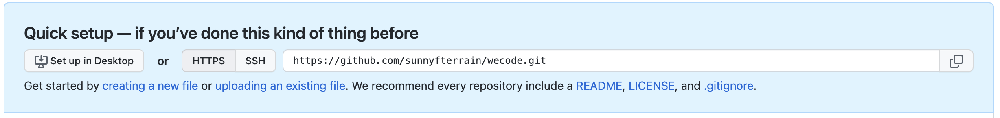

개발 업무에 필수적인 Git과 Github! 하지만 처음 사용할 때 명령어들이 너무 많고,  
어떤 순서대로 써야하는지도 모르겠고 너무 어려웠다.  

지금은 어느정도 능숙하게 쓰게 되었지만, 이제 막 git을 접하는 분들에게 바친다.  
부제 : git! github! 처음엔 이것만 알면 돼!!  

<!-- more -->

* this ordered seed list will be replaced by the toc
{:toc}  

# 깃과 깃허브의 차이?  
---  
정말 쉽게 얘기하면 Git은 내컴퓨터. 로컬에서만 파일 버전 관리를 하는 것이고,
Github는 내컴퓨터에서만 하던것을 네트워크 상의 저장소에 저장하여 버전 관리를 하는 것이다.

Github를 가입하지 않았다면 일단 먼저 가입하자.
# 내 프로젝트를 깃을 할수 있는 프로젝트로 만들기  
---  
## 첫번째 방법  

* 내가 하고 있는 프로젝트 중 Git 을 하고 싶은 폴더로 들어간다.  
* `git init` : 깃 초기화를 한다. 즉 내가 작업하고 있는 현재 폴더를 Git을 할 수 있게 만들어 준다.  
  * 해당 폴더로 가서 숨김 폴더 및 파일 해제 (mac:shift+cmd+.) 하면 '.git'이라는 폴더가 생겼을 것이다.  

## 두번째 방법  

* `git clone 주소` : git
* 먼저 깃 허브에서 새 repository 를 만들자.  
* 우리의 프로젝트를 저장할 저장소를 만드는 것이다.  

  

* 우측의 new 버튼을 눌러준다.  

  

* Repository name 에 저장소의 이름을 정해주자.  
* 비공개로하고 싶다면 Privae, 그렇지 않다면 Public 으로 해준다.  
* 처음 만들어 질때 같이 생성할 파일을 지정해 준다.  
  * 해도되고 안해도 된다.  
* Create repository 클릭!  

  

* 상단의 Code 부분을 누르면 이러한 것이 있다. 해당 http 주소를 복사하자.
* 터미널에서 원하는 프로젝트의 

* `git status` : 현재 작업 중인 파일을 보여주거나, 커밋 할 파일을 보여준다. 즉, 현재의 상황을 보여준다.
* `git add .` : 현재 작업중인 모든 파일을 git에 저장할 것이다 라고 지정해주는 것이다.  
  * .(마침표) 는 모두를 지정. 특정 파일만 하고 싶으면 작업 중인 목록 중에 원하는 것만 복사 붙여넣기 하면 된다.  
  * `git status` 를 해서 확인하자! 항상 확인하는 습관을 들여야 한다.  
* `git 